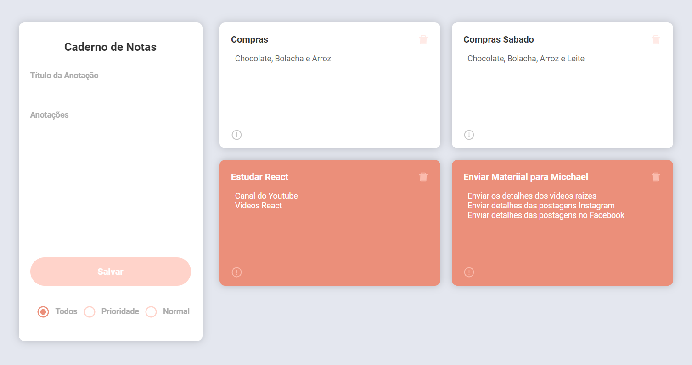

## Aplicativo desenvolvido para estudos da tecnologia React
Mais um estudo via Youtube! :boom:

---
#### Tecnologias
- ReactJS
- NodeJS
- MongoDB
- HTML
- CSS
- Express

--- 
#### Print do Aplicativo

---
#### Para usar(instalar) em sua maquina
1. clonar o repositório
   * git clone https://github.com/jonasbfranco/DayNotes.git

2. entrar na pasta backend
   * npm install
   * npm run dev
   * http://localhost:3333/annotations
  
3. entrar napasta frontend
   * npm install
   * npm start
   * http://localhost:3000 

___
#### Configurar o banco de dados
1. Banco de Dados MongoDB (online)
   * https://www.mongodb.com/
  
2. Configurar a conexao no arquivo dbConfig.js
   * src/config/dbConfig.js 

---

    
Tutorial

   1. Crie suas notas
   2. Edite as anotaçôes (caso necessite)
       * Editar o corpo da notas
       * Definir prioridade nas notas
       * Excluir uma nota (caso necessite)

#### Playlist do projeto
:construction: https://www.youtube.com/playlist?list=PL0QN_lbTofYcw7bzm8y-l2BMslKfMfNgr
 